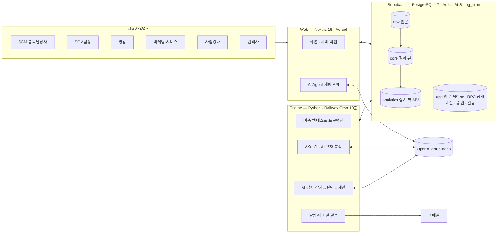
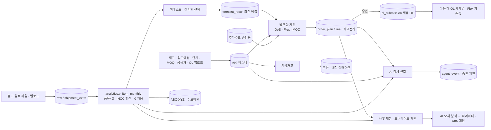
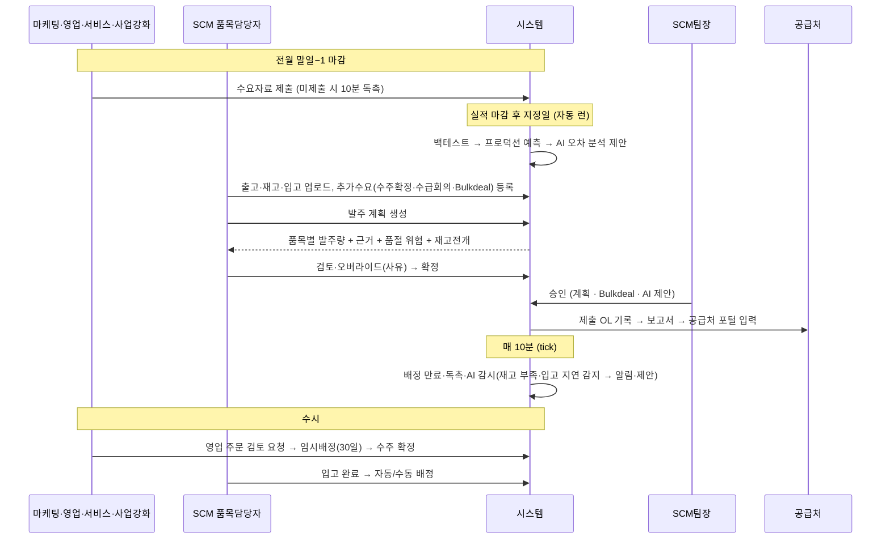

# SCMpro 한눈에 보기 — 목적 · 기능 · 구성도 · 데이터 흐름 · 업무 흐름 · 역할별 사용법

최종 갱신: 2026-09-14 · 이 문서는 시스템 전체 요약 설명임. 상세는 각 절 끝의 링크로.

## 1. 무엇을 하는 시스템인가
복합기 **부품·소모품·옵션**(수천 품목, 해외 공급처 5곳)의 **월간 발주량과 발주 시점**을 데이터로 정한다.
"과거 출고가 예측하고 → 회사 규칙(목표 DoS·Flex·MOQ)이 계산하고 → AI 가 감시·제안하고 → 사람이 승인한다."

| 목표 | 시스템이 하는 일 |
|---|---|
| 결품 최소화 | 품목별 수요 예측 + 재고 전개로 필요월 기초재고 < 수요인 품목을 미리 표시·알림 |
| 과잉 최소화 | 목표 재고일수(DoS) 기준 필요량 산출, 과잉 후보(DoS ≥ 목표 2배) 표시 |
| 발주 근거 투명화 | 모든 발주량에 예측·재고·입고·추가수요·Flex·MOQ 근거를 붙이고 승인 이력 보관 |
| 영업 주문 약속 가능 수량 | 가용재고 = 현재고 − 임시배정 − 확정배정 − 승인대기, 임시배정 30일 상태머신 |
| 계속 좋아지기 | 매월 자동 재학습·재예측, AI 오차 분석·파라미터 제안, 지난 발주 사후 채점 |

## 2. 전체 기능 맵 (메뉴 = 사이드바 6그룹)

| 그룹 | 화면 | 기능 | 규칙 |
|---|---|---|---|
| 현황 | 대시보드 | 역할별 KPI 5 + 재고 건전성·품절 리스크·발주 사이클·예측 신뢰도·운영 묶음, 전부 드릴다운 | R-UI-12/13 |
| | 알림 | 시스템 알림(이메일 복제), 읽음 처리 | R-SCH-21/30/31 |
| | AI 감시 | 자율 모드 이벤트(감지·판단·알림·제안·승인 상태), 유용/불필요 피드백, 채택률 | R-AI-10~15 |
| 계획 | 품목 | 품목 목록(카테고리·ABC-XYZ·패턴·챔피언·재고 0·과잉 필터) → 상세(출고·예측·백테스트 검증·제출 OL vs 실적·재고·입고) | R-FC-35, R-XCN |
| | 예측 | 정확도(기법·카테고리·패턴 WAPE), ABC-XYZ 히트맵·관리 지침, 등급별 재고, 12개월 추이, 기종 비교(Sales OL/SCM OL/기준예측/실적), 런 이력·요청, AI 조정 제안 | R-FC |
| | 발주 계획 | 계획 생성(예측+재고+입고+추가수요 → DoS/Flex/MOQ), 재고전개 그리드, 오버라이드(사유), 확정→승인→제출 OL, 보고서, 지난 계획 채점 | R-OQ |
| | 추가 수요 | 수주확정·수급회의·Bulkdeal 등록(Bulkdeal 은 팀장 승인, 이중 계상 경고) | R-OQ-20~26 |
| 운영 | 영업 주문 | 가용재고 조회, 검토 요청(임시배정/대기), 수주 확정, 취소 | R-AL |
| | 재고 배정 | 대기 큐, 입고 처리(자동배정), 수동·우선 배정(승인), 만료·알림 tick | R-AL-10~17 |
| | 배정 우선순위 | 사업강화부가 주문 우선순위 지정 | R-AL-11 |
| | 일정·제출 | 공급처 출항일→발주일·입고예정 캘린더(영업일), 수요자료 제출·독촉, 입고 차이 | R-SCH |
| 결재 | 승인함 | 품목 설정·발주 계획·Bulkdeal·우선 배정·AI 예측 조정·AI 감시 발주 제안 승인/반려 | R-OQ-40 |
| 데이터 | 데이터 업로드 | 재고·입고예정·품목 설정·장착률·공급처·EOL·공휴일·출고 실적(넓은 형식)·기종 OL/실적 | D-007, D-030, D-040 |
| | 품목 설정 | 목표 DoS·MOQ·단가·배정방식(승인 워크플로) | R-OQ-33 |
| | 예측 기법 | 13개 기법 on/off·파라미터 | R-FC-30, D-018 |
| 관리 | 시스템 설정 | 리드타임·Flex·DoS·알림 on/off·자동 런·AI 감시·보존 정책 등 (비개발자 UI) | R-UI-10 |
| | 공급처·공휴일·EOL/EOS·AI 통계 | 마스터·통계 | |
| 공통 | AI Agent 패널 | 모든 화면 우측 채팅(드래그 리사이즈), 시스템 데이터를 도구로 조회해 근거와 함께 답변, 대화 저장 | R-AI-01~07 |

## 3. 구성도

- 화면은 `analytics`·`app` 만 읽고, 원본 `raw` 는 수정하지 않는다. 업무 로직의 트랜잭션(배정·승인·업로드 반영)은 DB RPC 안에서, 계산(발주량)은 `web/lib/order/calc.ts`, 예측은 엔진.
- 권한은 역할(RLS) 로 DB 에서 강제 — 화면을 우회해도 못 본다/못 바꾼다. → `07-architecture.md`

## 4. 데이터 흐름

핵심 원칙: 예측은 **출고 실적만** 학습한다(실제 발주량은 순환 편향 때문에 넣지 않고 OL 시계열·규칙 보정·채점에만 쓴다). → `05-data-catalog.md`, `02-domain-rules/forecast.md`

## 5. 월간 업무 흐름 (누가 · 언제 · 무엇을)

상세 단계·SP 대응은 `01-business-process.md` §2·§7, `07-architecture.md` §5.1.

## 6. 역할별 사용법 요약

| 역할 | 매달 하는 일 | 주로 보는 화면 |
|---|---|---|
| **SCM 품목담당자** | 데이터 업로드 → 예측 확인 → 발주 계획 생성·검토·확정 → 입고·배정 처리 → AI 감시 알림 대응 | 데이터 업로드, 예측, 발주 계획, 재고 배정, AI 감시, 품목 |
| **SCM팀장** | 승인함(계획·Bulkdeal·우선 배정·AI 제안) 결재, 대시보드 감독, 예측 정확도·채점 확인 | 승인함, 대시보드, 예측, 발주 보고서 |
| **영업** | 가용재고 조회 → 검토 요청 → 30일 내 수주 확정, 수요자료 제출 | 영업 주문, 일정·제출 |
| **마케팅 · 서비스** | 수요자료 제출, 추가수요(수급회의) 입력, 배정 결과 확인 | 일정·제출, 추가 수요, 알림 |
| **사업강화** | 주문 우선순위 지정, GC 별도 확인분 입력, 수요자료 제출 | 배정 우선순위, 추가 수요 |
| **관리자** | 계정·역할, 시스템 설정(리드타임·DoS·Flex·알림·자동 런·AI 감시·보존), 공급처·공휴일·EOL, AI 통계 | 관리 그룹 전체 |

역할별 단계별 시나리오·FAQ 는 `08-user-guide.md`.

## 7. 어디를 더 보면 되나
| 알고 싶은 것 | 문서 |
|---|---|
| 용어 (OL, DoS, HOC, Flex, XCN …) | `00-glossary.md` |
| 현행 업무·조직·KPI | `01-business-process.md` |
| 구현 규칙 (R-FC/OQ/INV/AL/BOM/XCN/SCH/UI/AI) | `02-domain-rules/*.md` |
| 왜 그렇게 결정했나 (D-001~) | `03-decisions.md` |
| 아직 회사 확인이 필요한 것 (Q-) | `04-open-questions.md` |
| 파일 → 테이블 → 뷰, 정제 규칙 | `05-data-catalog.md` · `06-data-profile.md` |
| 구성 요소·스키마·권한·흐름·배치·디렉터리 | `07-architecture.md` |
| 역할별 사용법·FAQ | `08-user-guide.md` |
| ERP/MES 연동 계획 | `09-integration-plan.md` |
| 운영·배포(Vercel·Railway·Supabase)·백업 | `10-operations.md` |
| 검증 결과·정확도 수치 | `reports/final-verification.md`, `reports/sp2-backtest-fy25.md` |
